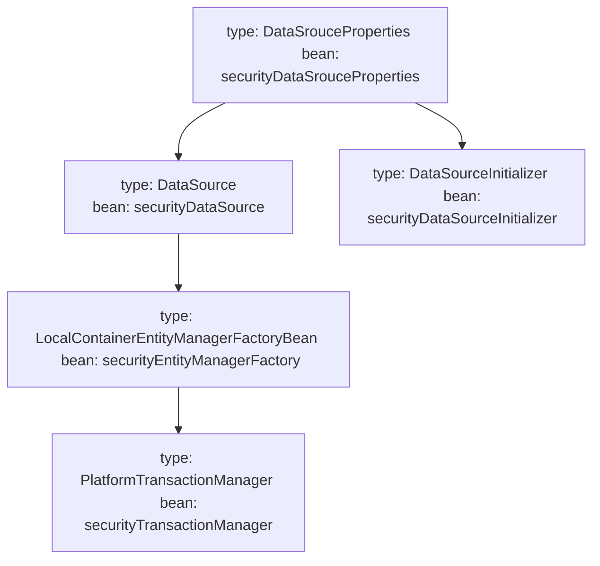

1. ==The Java Persistence API (JPA) is an Object Relational Mapping (ORM) framework== that's part of the `Java EE platform`.
2. JPA simplifies the implementation of the data access layer by letting developers work with an object oriented API instead of writing  SQL queries by hand.
3. The most popular JPA implementations are-
	1. `Hibernate`
	2. `EclipseLink`
	3. `OpenJPA`
4. `spring-boot-starter-data-jpa`
5. Spring Data JPA not only provides CRUD operations out-of-the-box, but it also supports dynamic query generation based on the method names.
6. `@Query` - annotation for configuring the query explicitly
7. `@Query` + `@Modifying` - to perform data update operations
8. If `in-memory database (H2)` driver is configured then SB automatically registers a `DataSource`.
9. Because of `spring-boot-starter-data-jpa` dependency, SB auto-configuration takes care of creating the JPA related beans like `LocalContainerEntityManagerFactoryBean`, `TransactionManager`, etc. automatically with sensible defaults.
10. Suppose, we want to get all users by their names in ascending order-
    ```java
    Sort sort = new Sort(Direction.ASC, "name");
    List<User> users = userRepository.findAll(sort);
	```
11. Multiple property sorting-
	```java
    Order order1 = new Order(Direction.ASC, "name");
    Order order2 = new Order(Direction.DESC, "id");
    Sort sort = Sort.by(order1, order2);
    List<User> users = userRepository.findAll(sort);
    int size = 25;
    
    /* Pagination with `Pageable` and `PageRequest` */
	int page = 0; 
	Pageable pageable = PageRequest.of(page, size);
	Page<User> usersPage = userRepository.findAll(pageable);

	/* Pagination along with sorting */
	Sort sort = new Sort(Direction.ASC, "name");
	Pageable pageable = PageRequest.of(page, size, sort);
	Page<User> usersPage = userRepository.findAll(pageable);
	```

12. Get additional details, like the total number of pages, the current page number, whether there is a next page, whether there is a previous page, and more-
* Returns the total amount of elements - `usersPage.getTotalElements();`
* Returns the total number of pages - `usersPage.getTotalPages();`
* checks if there is next page - `usersPage.hasNext();`
* checks if there is previous page - `usersPage.hasPrevious();`
* to extract the actual data - `List<User> usersList = usersPage.getContent();`


15. If it is needed to connect to multiple databases, need to configure various Spring beans like-
	1. `DataSource`
	2. `TransactionManagers`
	3. `EntityManagerFactoryBeans`
	4. `DataSourceInitializers`
### Working with Multiple Databases
To connect to multiple databases, need to configure  various Spring beans like- 
* `DataSource`
* `TranscationManagers`
* `EntityManagerFactoryBeans`
* `DataSourceInitializers`, etc.

1. Add the `data-jpa` starter
2. Turn off the DataSource/Jpa auto-configuration by excluding `AutoConfiguration` classes
3. Enable *TransactionManagement* explicity with `@EnableTranscationManager` annotation
4. Configure the datasource properties inside the `application.properties` file
5. Create entities and JPA repositories sub-interfaces
6. Create configuration classes for connecting to each of the respective databases by configuring the Spring beans such as `DataSource`, `TranscationManager`, `EntityManagerFactoryBean`, `DataSourceInitializer` . For example, we have a DB called `Security` and the respective `SecurityDBConfig` would look as such-
	```java
   package com.apress.demo.config;
	@Configuration
	@EnableJpaRepositories(
	        basePackages = "com.apress.demo.security.repositories",
	        entityManagerFactoryRef = "securityEntityManagerFactory",
	        transactionManagerRef = "securityTransactionManager"
	)
	public class SecurityDBConfig
	{
	    @Autowired
	    private Environment env;

	    @Bean
	    @ConfigurationProperties(prefix="datasource.security")
	    public DataSourceProperties securityDataSourceProperties()
	    {
	        return new DataSourceProperties();
	    }

	    @Bean
	    public DataSource securityDataSource()
	    {
	        DataSourceProperties securityDataSourceProperties = securityDataSourceProperties();
	        return DataSourceBuilder.create()
	                .driverClassName(securityDataSourceProperties.getDriverClassName())
	                .url(securityDataSourceProperties.getUrl())
	                .username(securityDataSourceProperties.getUsername())
	                .password(securityDataSourceProperties.getPassword())
	                .build();
	    }
	     
	    @Bean
	    public PlatformTransactionManager securityTransactionManager()
	    {
	        EntityManagerFactory factory = securityEntityManagerFactory().getObject();
	        return new JpaTransactionManager(factory);
	    }
	     
	    @Bean
	    public LocalContainerEntityManagerFactoryBean securityEntityManagerFactory()
	    {
	        LocalContainerEntityManagerFactoryBean factory =
	                new LocalContainerEntityManagerFactoryBean();
	        factory.setDataSource(securityDataSource());
	        factory.setPackagesToScan("com.apress.demo.security.entities");
	        factory.setJpaVendorAdapter(new HibernateJpaVendorAdapter());
	        Properties jpaProperties = new Properties();
	        jpaProperties.put("hibernate.hbm2ddl.auto", env.getProperty("hibernate.hbm2ddl.
	auto"));
	        jpaProperties.put("hibernate.show-sql", env.getProperty("hibernate.show-sql"));
	        factory.setJpaProperties(jpaProperties);
	        return factory;
	        }
	        
	        @Bean
		  public DataSourceInitializer securityDataSourceInitializer()
		  {
		      DataSourceInitializer dsInitializer = new DataSourceInitializer();
		      dsInitializer.setDataSource(securityDataSource());
		      ResourceDatabasePopulator dbPopulator = new ResourceDatabasePopulator();
		      dbPopulator.addScript(new ClassPathResource("security-data.sql"));
		      dsInitializer.setDatabasePopulator(dbPopulator);
		      dsInitializer.setEnabled(env.getProperty("datasource.security.initialize",
		                              Boolean.class, false) );
		      return dsInitializer;
		  }
	    
	```

Here's a visual representation of the bean's inter-operability

 **Canvas:** [[Working with Multiple Databases.canvas|Working with Multiple Databases]]



7. The `@EnableJpaRepositories` annotation used to enable the Spring Data JPA support
8. Since there are multiple `EntityManagerFactory` and `TransactionManage` beans, the beans IDs for `entityManagerFactoryRef` and `transactionManagerRef` where configured by pointing to the respective bean names
9. Need to register `OpenEntityManagerInViewFilter` beans in order to enable lazy loading of JPA entity LAZY associated collections while rendering the view in case of working with multiple database configuration set up in a web application
### **Simplified Flow for `OpenEntityManagerInViewFilter`**
1. **Incoming Web Request** → `OpenEntityManagerInViewFilter` starts and keeps the `EntityManager` open.
2. **Service Layer** processes the request → Transactions are managed as usual.
3. **View Rendering** begins → Lazy-loaded data is fetched because the `EntityManager` is still open.
4. **Response Sent** → `EntityManager` is closed by the filter.

